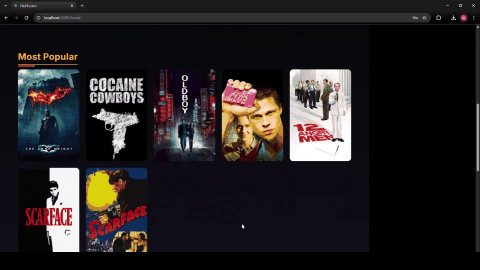

# 🎬 FlickFusion

A full-stack web application where users can search, review, and interact with movies and each other. Built with **React**, **Node.js (Express)**, and **PostgreSQL** with TMDB API integration.

---

## 🌟 Features

- 🔐 Authentication (Login, Signup)
- 🧾 Post and view movie reviews
- ❤️ Like / Dislike reviews
- 🙋 Follow / Unfollow users
- 📝 Edit Profile (Profile Pic, Username, Display Name)
- 🔍 Search movies by title (with TMDB API)
- 🎞️ View Trending / Top Rated / Popular movies
- 👤 View other users’ profiles and their reviews
- 🍪 Cookie-based Auth

---

## 📷 Demo




[![Watch the full demo video]](frontend/public/assets/FlickFusion_Demo.mp4)


---

## 🚀 Tech Stack

**Frontend**: React, HTML, CSS  
**Backend**: Node.js (Express)  
**Database**: PostgreSQL  
**Auth**: Cookies, JWT, Google OAuth  
**API**: [TMDB](https://www.themoviedb.org/documentation/api)

---

## 🛣️ Roadmap

### ✅ Completed

- User login & signup (with Google)
- Post and view reviews
- Like/Dislike reviews
- Follow/Unfollow users
- Edit profile
- Trending, Top Rated, and Popular movies

### 🛠️ In Progress

- Edit & Delete Reviews

### 🔮 Planned Features

- 🔐 Forgot password & account recovery
- 📱 Social logins (Facebook, Twitter, etc.)
- 📧 Email & phone number verification
- 🔎 Advanced search filtering (genre, year, rating)
- 💬 Replies to reviews
- 🧠 Personalized movie recommendations using ML (based on likes/follows)

---

## 🛠️ How to Run Locally

1. Clone this repository:
   ```bash
   git clone https://github.com/your-username/flickfusion.git
   cd flickfusion
   ```
2. Install dependencies:
   ```bash
   cd backend   # for backend
   npm install

   cd frontend   # for frontend
   npm install
   ```
3. Set environment variables for TMDB token, JWT secret, DB credentials, etc.

4. Run the project:
   ```bash
   cd backend
   node index.js

   cd frontend
   npm start
   ```

---

## 🙋‍♂️ Author

Gudi Srikanth

---

## ⭐ Show Your Support

If you liked this project, please ⭐ the repository and feel free to fork and contribute!

---
